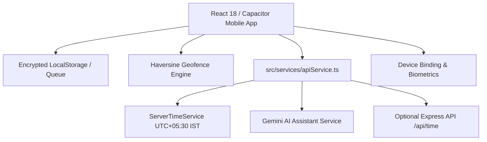

# LogiHR – Mobile Employee Self Service (ESS)
**LogiBrisk Technologies · Timezone: Asia/Kolkata (IST, UTC+05:30)**

LogiHR is an enterprise-grade mobile ESS application providing **tamper-proof IST attendance**, **multi-row daily timesheet logging**, **policy-aware leave management**, and **manager approval workflows**.

---

## Architecture Overview



---

## Security Principles & Anti-Tampering

1. **Tamper-Proof IST Time Stamping**:
   - The mobile client **never passes a punch timestamp**.
   - All punches are stamped solely by the authoritative server time (Asia/Kolkata).
   - If a device clock deviates by > 2 minutes from network time, a prominent alert banner is displayed and client drift is recorded in audit logs.
2. **Device Binding**:
   - Each employee is tied to one registered device (`Google Pixel 8 Pro DEV-PX8-9941`).
3. **Geofence Enforcement**:
   - Real-time Haversine calculation against Surat HQ (250m), Ahmedabad Hub (200m), and Mumbai BKC Client Site (150m).
4. **DPDP Act (India) Compliance**:
   - Location is captured exclusively during the punch action (no background GPS snooping).
   - Biometric face recognition in kiosk mode processes embeddings only; raw photos are never permanently stored.

---

## Exact Screen Specifications Implemented

- **3.1 Login**: Company (read-only: LogiBrisk Technologies), Employee ID / Mobile No.*, Password* (show/hide), Sign In, Forgot Password (OTP flow), Biometric login, Device registration.
- **3.2 Dashboard (Home)**: Greeting based on IST time, live status card, timesheet summary, quick actions, leave quota cards, holiday banner, birthday confetti, team on leave.
- **3.3 Attendance (Today)**: Authoritative IST live clock, circular punch button (Check In / Check Out), live elapsed work ticker, geofence status & distance, break in/out, regularization modal, WFH / On-duty mode, offline queue.
- **3.4 Attendance History**: Month switcher, Present/Absent/Late summary cards, interactive filter pills, list view & calendar heat-map toggle, PDF export.
- **3.5 Add Leave (Exact Fields)**:
  1. `Employee Name*` (default: "Parth : Parth Bhutka")
  2. `Leave Type*` (--SELECT-- : Casual Leave, Sick Leave, Earned/Privilege Leave, Compensatory Off, Leave Without Pay)
  3. `From Date*` and `To Date*` (DD/MM/YYYY hh:mm A)
  4. `Is Half Day` (checkbox) & `No Of Days` (auto-calculated excluding weekly offs and holidays, 0.5 for half day)
  5. `Reason*` (textarea)
  6. `Approvers Name*` (default: Vikram Shah)
  7. Extras: available-balance banner, attachment, overlap check, insufficient-balance warning
  8. Buttons: `Close` (grey) and `Save` (blue)
- **3.7 Add Time Sheet (Exact Fields)**:
  1. `TimeSheet Date`
  2. `+ ADD DETAIL TIME`
  3. `Tip: Enter start/end time, pick activity, and press Enter in description to add next row quickly.`
  4. Card rows with `START TIME`, `END TIME`, `HOURS` (auto-calculated HH:MM), `TASK NO`, `MODUAL TASK ACTIVITY` (exact spelling preserved), `DESCRIPTION`, `ACTION` (+ add row below, x delete row)
  5. Enter key in Description adds next row and pre-fills start time = previous end time
  6. `Total Hours` footer (HH:MM)
  7. Buttons: `Close` (grey) and `Save` (blue), "Copy yesterday", "Recent tasks", and Jira/GitHub task auto-suggest.
- **3.10 Manager: Approvals**: Segments (Leave, Regularization, Timesheet, WFH), bulk approve, reject with comment modal, team attendance today.
- **3.18 Smart Reminders**: Geofence arrival reminder, shift-end check-out reminder, pending timesheet reminder.
- **3.20 AI Assistant**: Trilingual chat (English, ગુજરાતી, हिन्दी) with tool calling and explicit confirmation cards.
- **3.31 Kiosk Mode**: Entrance tablet simulation with face recognition punch and admin PIN lock.
- **Phase 2 Modules**: Expenses, HR Letters, Tax & PF documents, Shift Roster, Loan & Advance, Org Directory, Kudos & Polls, Burnout Insights.

---

## Mobile Packaging (Android & iOS with Capacitor)

### 1. Install Capacitor Plugins
```bash
npm install @capacitor/core @capacitor/cli @capacitor/geolocation @capacitor/camera @capacitor/push-notifications @capacitor/preferences @capacitor/network @capacitor/device
```

### 2. Add Platforms & Sync
```bash
npm run build
npx cap add android
npx cap add ios
npx cap sync
```

### 3. Build Android APK / AAB
```bash
npx cap open android
# In Android Studio:
# Build -> Build Bundle(s) / APK(s) -> Build APK(s)
# Or via CLI:
cd android && ./gradlew assembleDebug
```

### 4. Build iOS Xcode Project
```bash
npx cap open ios
# Requires macOS with Xcode 15+
```

---

## How to Run

### Development Mode (Vite)
```bash
npm run dev
```

### Optional Express Server (Authoritative /api/time endpoint)
```bash
npx tsx server/index.ts
```

### Build for Production
```bash
npm run build
```
